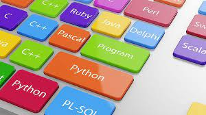

## Hi! I am Jaskaran 

-[code mode] (#code-mode-)
I am web development student at humber college

Learn more  <a href="about">about</a> me.

Currenty learning programming languages

## Articles
- ["How To Create A GitHub Profile README"](https://www.aboutmonica.com/blog/how-to-create-a-github-profile-readme) - *Monica Powell*

## Tutorials 
- ["How to create a GitHub profile README"](https://www.youtube.com/watch?v=vND_UY7xk24) - *Code With Confidence*

